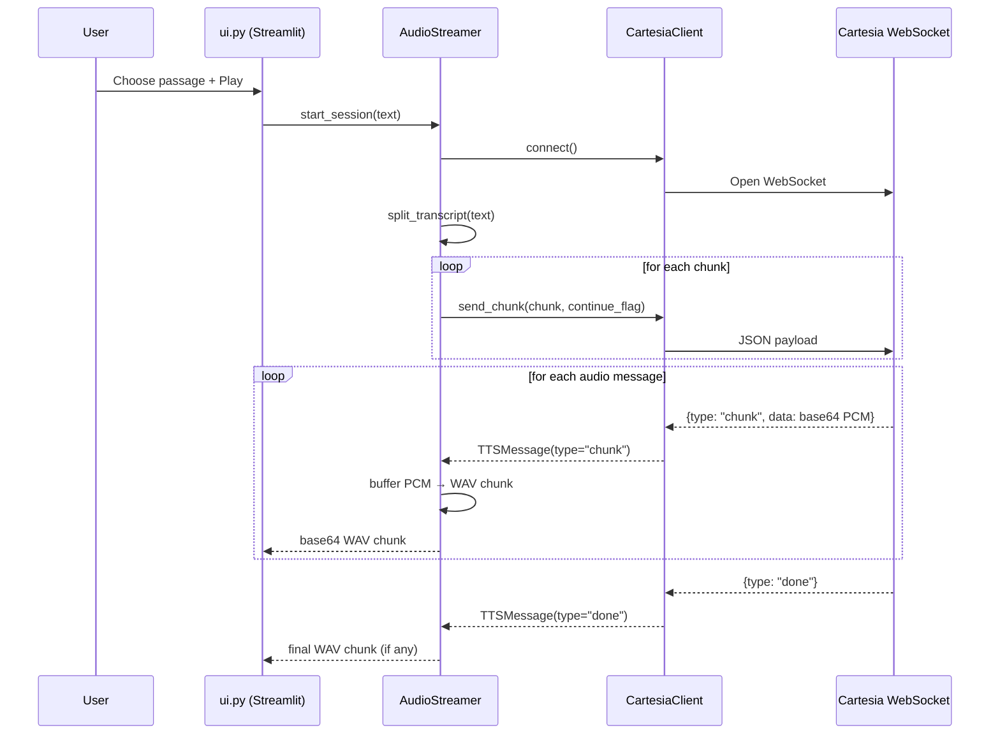

# Cartesia Streamlit Reader

A minimal Streamlit web app that streams text‑to‑speech audio from Cartesia’s WebSocket API and plays it in the browser.

## What this app does

1. Lets you pick a built‑in text passage.
2. Sends the passage to Cartesia in multiple chunks (if needed).
3. Receives raw PCM audio chunks over WebSocket.
4. Buffers PCM into WAV chunks and plays them progressively in the UI.

## Audio generation flow

### High‑level steps

1. **User selects a passage** in `ui.py`.
2. **AudioStreamer starts a session** and opens a WebSocket via `CartesiaClient`.
3. **Text is split** into manageable chunks by `split_transcript`.
4. **Chunks are sent** to Cartesia with `continue=true` on all but the last.
5. **PCM audio chunks arrive** as base64 strings.
6. **PCM is buffered** until it’s big enough for a smooth WAV chunk.
7. **PCM → WAV conversion** happens in memory.
8. **WAV chunks are base64‑encoded** and pushed to the UI.
9. **Streamlit re‑renders** and the audio player queues the new WAV data.

### Sequence diagram



### Component responsibilities

- `ui.py`
  - Builds the Streamlit UI.
  - Starts streaming and feeds audio chunks to the player.
  - Triggers reruns for progressive playback.

- `audio_streamer.py`
  - Orchestrates chunk sending and audio reception.
  - Buffers PCM and converts to WAV.
  - Streams WAV chunks to the UI.

- `cartesia_client.py`
  - Handles WebSocket connection.
  - Builds and sends request payloads.
  - Parses incoming messages into dataclasses.

- `text_utils.py`
  - Splits long passages into chunks suitable for streaming.

## How chunking works

- Text is normalized (whitespace collapsed).
- It is split by sentence boundaries when possible.
- Chunks are capped at `MAX_CHARS_PER_CHUNK` (default 900).
- Very long sentences are hard‑split to stay under the limit.

## How audio buffering works

- Cartesia returns **raw PCM** chunks (base64 encoded).
- PCM is buffered until it reaches roughly `MIN_CHUNK_SECONDS` of audio.
- Buffered PCM is wrapped into a WAV container for browser playback.

## Running the app

```bash
python -m venv venv
source venv/bin/activate
pip install -r requirements.txt
export CARTESIA_API_KEY="your_key_here"
streamlit run app.py
```

## Environment variables

- `CARTESIA_API_KEY` (required in UI)
- `CARTESIA_VERSION` (default: 2025‑04‑16)
- `CARTESIA_MODEL_ID` (default: sonic‑2)
- `CARTESIA_VOICE_ID` (default: a0e99841‑438c‑4a64‑b679‑ae501e7d6091)
- `CARTESIA_SAMPLE_RATE` (default: 44100)

## Troubleshooting

- If audio cuts out, try lowering passage length or sample rate.
- If playback is muffled, increase sample rate or buffer size.
- If you see errors in the UI, check your API key and network access.
